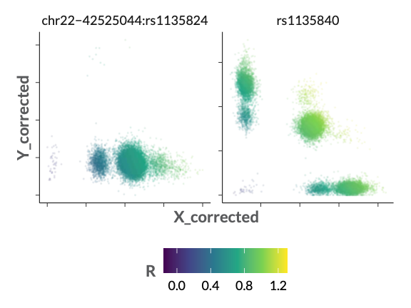
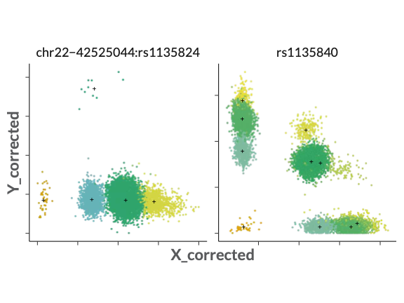

CNV caller
================

The _CYP2D6_ Gene is an important gene within pharmacogenomics. 
About 25% of our medication is broken down by the protein product of _CYP2D6_.
There are an extensive number of variations on the _CYP2D6_ Gene described, which include SNPs, CNVs, 
partial CNVs and other complex arrangements. To the best of our knowledge, 
current CNV calling methods do not provide optimal results for _CYP2D6_, given that we wish to be returning pharmacogenetic results to individuals, based on GSA array genotyping.
This CNV caller is developed to type variations within the _CYP2D6_ gene confidently.

# Background

To type CNVs using a GSA chip, we leverage raw intensities that are present in the Illumina final report files.
These intensities represent how strong the signal is for each tested allele, per variant, and thus, 
they indicate how much of the given allele is present. Using these intensities, we aim to type CNV status of each sample.
CNV status can either be 0 copies (-2 compared to reference), 1 copy (-1 compared to reference), 
2 copies (the reference number), and 3 or more copies (at least +1 compared to reference).

Besides raw intensities, we can also leverage the fact that the GSA chip for some variants feature
multiple assays. We hypothesized that by taking into account multiple assays per variant, we are able
to better typing of these variants still.

Example variants are shown below.


*Corrected intensities of two variants in the CYP2D6 region. Both variants show a clear CNV pattern.
The X-axis shows intensity of one allele, while the Y-axis shows intensity of the other alleles.*


*CNV calling output for the two example variants. Orange indicates 0 copies, blue 1 copy, green 2 copies, and yellow represents 3 or more copies.*
# Approach

This method performs CNV calling in a number of steps:
 - Variant selection
 - Data preparation
 - Fitting CNV calling models / Calling CNVs
   - Batch correction
   - Naive clustering (only done in fitting step)
   - CNV typing

## Variant selection
Usage: (from https://github.com/CAWarmerdam/PGx-pipeline/blob/master/protocols/corrective_variants.sh)

```bash
#MOLGENIS walltime=23:59:00 mem=500mb nodes=1 ppn=8

### variables to help adding to database (have to use weave)
###

#string plinkVersion
#string genotypesDir
#string correctiveVariantsOutputDir

#Load module
module load "${plinkVersion}"

mkdir -p ${correctiveVariantsOutputDir}

echo $'6\t28477797\t35000000\tHLA\n' > hla_range.bed

for genotypesPlinkPrefix in "${genotypesPlinkPrefixArray[@]}"
do

  basePlinkPrefix=$(basename ${genotypesPlinkPrefix})

  correctiveVariantFiles+=("${correctiveVariantsOutputDir}/${basePlinkPrefix}.prune.in")

  plink \
    --bfile ${genotypesPlinkPrefix} \
    --out ${correctiveVariantsOutputDir}/${basePlinkPrefix}\
    --geno 0.01 \
    --maf 0.05 \
    --hwe 0.01 \
    --exclude 'range' hla_range.bed \
    --bp-space 100000 \
    --indep-pairwise 500 5 0.4

done

cat "${correctiveVariantFiles[@]}" > ${correctiveVariantsOutputDir}/merged.prune.in

module purge
module load "${pythonVersion}"
module list

source ${pythonEnvironment}/bin/activate

python ${asterixRoot}/src/main/python/cnvcaller/core.py variants \
  --bead-pool-manifest "${bpmFile}" \
  --sample-list "${sampleListPrefix}.samples.txt" \
  --bed-file "${cnvBedFile}" \
  --corrective-variants "${correctiveVariantsOutputDir}/merged.prune.in" \
  --window 250kb \
  --config ${asterixRoot}/src/main/python/cnvcaller/conf/config.yml \
  --out "${correctiveVariantsOutputDir}"
```

### Prerequisites
First, we attempt to correct for batch effects present in raw intensities.
To do this, using plink, we select normal,
biallelic variants from all over the genome (1% < missingness, 5% > minor allele frequency, hwe p-value > 0.01, HLA region excluded, 0.1Mb spacing),
and prune based on an R2 threshold of 0.4, tested within 500 variant window which is shifted by 5 variants between tests.

### Variant selection (`core.py variants`)
Based on the given variants and the GSA-specific .BPM file, within the CNV caller, 
filtered variants are thinned further so that the number of variants is proportional 
to the number of variants in each chromosome. Also, using a bed file describing the _CYP2D6_ gene location,
we exclude variants in this gene from the corrective variant selection, and make a separate list of the
variants that are available for the _CYP2D6_ gene.

## Data preparation (`core.py data`)
usage: (from https://github.com/CAWarmerdam/PGx-pipeline/blob/master/protocols/stage_intensities.sh)

```bash
#MOLGENIS walltime=02:00:00 mem=2gb ppn=1

#string pythonVersion
#string pythonEnvironment
#string bpmFile
#string asterixRoot
#string arrayFinalReport
#string arrayStagedIntensities
#string sampleListPrefix

set -e
set -u

module load "${pythonVersion}"
module list

source ${pythonEnvironment}/bin/activate

mkdir -p ${stagedIntensities}

python ${asterixRoot}/src/main/python/cnvcaller/core.py data \
--bead-pool-manifest "${bpmFile}" \
--sample-list "${sampleListPrefix}.samples.txt" \
--variants-prefix "${correctiveVariantsOutputDir}" \
--final-report-file-path ${arrayFinalReport} \
--out "${arrayStagedIntensities}" \
--config ${asterixRoot}/src/main/python/cnvcaller/conf/config.yml
```

Data preparation converts a folder of final report files to a pandas dataframe, including only the required variants,
which makes it easier to work with in subsequent steps:

```python
intensity_data_reader = FinalReportGenotypeDataReader(
    args.final_report_file_path,
    sample_list["Sample_ID"].values,
    variants_to_read.as_df())

intensity_data = intensity_data_reader.read_intensity_data()

intensity_data.to_pickle(args.out)
```

## Fitting CNV models (`core.py fit`)
usage: (from https://github.com/CAWarmerdam/PGx-pipeline/blob/master/protocols/cnv_fit_transform.sh)
```bash
#MOLGENIS walltime=02:00:00 mem=2gb ppn=1

#string pythonVersion
#string pythonEnvironment
#string bpmFile
#string cnvOutDir
#string correctiveVariantsOutputDir
#string asterixRoot
#string arrayStagedIntensities
#string sampleListPrefix

set -e
set -u

# Now load the python version and activate the python environment
# to perform cnv calling
module load "${pythonVersion}"
module list

mkdir -p "${cnvOutDir}"

source ${pythonEnvironment}/bin/activate

python ${asterixRoot}/src/main/python/cnvcaller/core.py fit \
  --bead-pool-manifest "${bpmFile}" \
  --sample-list "${sampleListPrefix}.samples.txt" \
  --variants-prefix "${correctiveVariantsOutputDir}" \
  --out "${cnvOutDir}" \
  --input "${arrayStagedIntensities[@]}" \
  --config ${asterixRoot}/src/main/python/cnvcaller/conf/config.yml
```

### Correcting batch effects
To correct batch effects, we leverage the normal, bi-allelic variants that we selected in the first step. 
Using the summed intensities per variant per sample, we perform PCA. Using the outputs of the PCA, we fit linear 
models to find linear relationships between principal components (describing batch effects) and the intensities of 
variants within the CNV region. Subsequently, we regress out the batch effects from the intensities in the CNV region.

```python
# Do correction of intensities
intensity_correction = IntensityCorrection(
   variants_in_locus.Name,
   **intensity_correction_parameters)
print("Calculating PCA loadings for genome-wide batch effects...")
batch_effects = intensity_correction.batch_effects_train(
   reference_intensity_data=intensity_matrix.T)
print("Calculating batch effect corrections...")
corrected_intensities = intensity_correction.fit(
   batch_effects=batch_effects,
   target_intensity_data=intensity_matrix.T)
print("Intensity correction complete.", end=os.linesep*2)
```

### Naive clustering
Using known CNV status frequencies and a variant that shows a very clear clustering, 
a naive clustering can be performed that assigns CNV status according to the expected frequencies.
We have so far done this for a variant for which 3 separate assays are present on the genotyping chip.

Following initial naive clustering, we do a slightly less naive clustering by performing a majority vote 
over the three separate assays (election threshold of 50%). Subsequently, we perform one round of estimation
maximization by updating copy number assignments given the means and standard deviations of the clusters 
obtained after majority voting.

```python
        # Get variants to use for initial clustering
        print("Starting naive clustering...")
        ranges_for_naive_clustering = load_ranges_from_config(
            args.config['naive clustering'])

        variants_for_naive_clustering = (
            variants_in_locus.overlap(ranges_for_naive_clustering))

        naive_clustering = NaiveHweInformedClustering(
            genotype_labels=[-2, -1, 0, 1], ref_genotype = 2)
        copy_number_frequencies = naive_clustering.get_copy_number_genotype_frequencies()
        naive_copy_number_assignment = naive_clustering.get_copy_number_assignment(
            corrected_intensities[variants_for_naive_clustering.Name.values],
            copy_number_frequencies)
        naive_clustering.write_output(
            args.out, naive_copy_number_assignment)
        print("Naive clustering complete", end=os.linesep*2)
        less_naive_copy_number_assignment = (
            naive_clustering.update_assignments_gaussian(
            corrected_intensities[variants_for_naive_clustering.Name.values]))
```

### CNV calling

Actual CNV calling is done using a small selection of variants.
A mean-shift clustering is performed on these variants. Given the expected number of clusters for a given
CNV status, and the naive clustering, we remove some clusters, and assign the remaining clusters to the
CNV status that best represents the mean-shift clustering. Subsequently, 
we do a number of rounds of estimation maximization through gaussian mixture models until the remaining clusters
do not change any further.

Further details are documented in the `SnpIntensityCnvCaller` class.

```python
cnv_caller = SnpIntensityCnvCaller(
            (np.array([-2, -1, 0, 1]) + 2),
            assignments_to_resp(less_naive_copy_number_assignment.values))
        cnv_caller.fit(intensity_dataset._variants[0], initialization_bandwidth=0.16)
        cnv_caller.fit(intensity_dataset._variants[1], initialization_bandwidth=0.16)
        cnv_caller.fit(intensity_dataset._variants[2], initialization_bandwidth=0.16)
        cnv_caller.write_fit(intensity_dataset, args.out)
```

